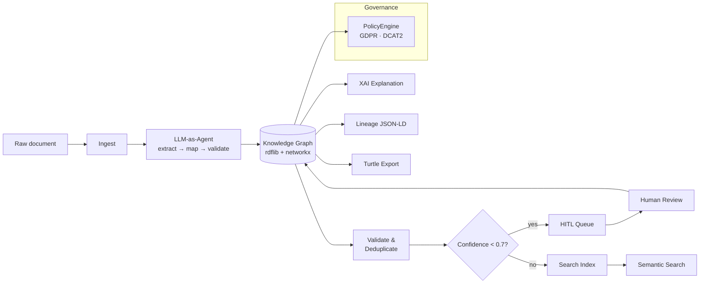
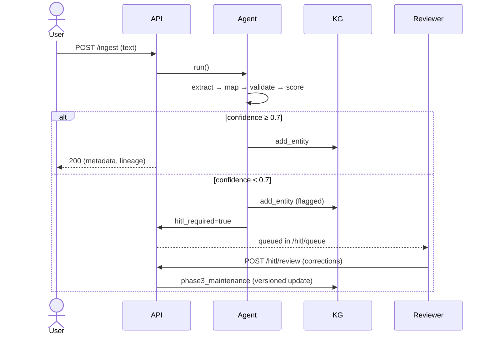

# 🕸️ Metadata KG — AI Metadata Automation with Knowledge Graphs

> DCAT 2 / DCMI–aligned · LLM-as-Agent extraction · XAI traceability · Human-in-the-Loop · ready to deploy to **Streamlit Cloud** & **FastAPI**

[](https://www.python.org/)
[](LICENSE)
[](https://github.com/astral-sh/ruff)

---

## ✨ What it does

1. **Ingest** raw documents (text, JSON, YAML, PDF).
2. **Extract** DCAT 2 metadata using an **LLM-as-Agent** (Claude `claude-sonnet-4-20250514`) with a deterministic fallback when no API key is set.
3. **Validate** entities against a Knowledge Graph (rdflib + networkx).
4. **Govern** with policy-as-code (GDPR PII rules, DCAT mandatory fields).
5. **Explain** decisions via lineage + reasoning logs (XAI).
6. **Search** the catalog semantically (sentence-transformers) or keyword-wise (BM25) or hybrid.
7. **HITL** queue surfaces low-confidence extractions for human review.

---

## 🏗️ Architecture



---

## 📂 Project structure

```
metadata_kg/
├── core/
│   ├── kg_builder.py        Knowledge Graph construction (rdflib + networkx)
│   ├── llm_agent.py         LLM-as-Agent orchestrator (LangChain + Claude)
│   └── metadata_schema.py   DCAT 2 / DCMI Pydantic schema
├── pipeline/
│   ├── ingest.py            Multi-format ingestion (text/JSON/YAML/PDF)
│   ├── extract.py           LLM-based metadata extraction
│   ├── validate.py          KG consistency validation
│   └── lifecycle.py         Metadata lifecycle (4 phases)
├── governance/
│   ├── lineage.py           PROV-O data lineage
│   ├── policy.py            Policy-as-code (GDPR, mandatory fields)
│   └── xai.py               Explainability layer
├── search/
│   └── semantic_search.py   Sentence-transformers + BM25 hybrid
├── api/
│   └── routes.py            FastAPI REST endpoints
└── tests/                   pytest suite + benchmark.py
streamlit_app.py             Web UI (Streamlit Cloud–ready)
```

---

## 🚀 Setup

```bash
# Clone
git clone <your-repo-url> graph_rag-V4
cd graph_rag-V4

# Create venv (Python 3.11+ required)
python3.11 -m venv .venv
source .venv/bin/activate

# Install (choose one)
pip install -e ".[dev]"          # uses pyproject.toml
# or
pip install -r requirements.txt   # used by Streamlit Cloud

# Optional: copy env template
cp .env.example .env
# Then edit ANTHROPIC_API_KEY=...
```

For PDF support: `pip install -e ".[pdf]"`.

---

## 🎯 Usage

### 1. Python API

```python
from metadata_kg.pipeline.lifecycle import MetadataLifecycle

lc = MetadataLifecycle()                # creates KG + Lineage + Agent
results = lc.run_full(
    "Title: Bangkok PM2.5 2024\n"
    "Description: Hourly PM2.5 measurements from 50 stations.",
    source="catalog/manual",
)
eid = results["creation"].entity_ids[0]
print(lc.kg.get_entity(eid))
```

### 2. FastAPI server

```bash
metadata-kg-api               # or: python -m metadata_kg.api.routes
# → http://localhost:8000/docs
```

Endpoints:

| Method | Path                | Purpose                                  |
|--------|---------------------|------------------------------------------|
| POST   | `/ingest`           | submit raw text → extract + store        |
| GET    | `/metadata/{id}`    | retrieve metadata + provenance           |
| GET    | `/search?q=…`       | semantic / keyword / hybrid search       |
| POST   | `/validate/{id}`    | DCAT validation report                   |
| GET    | `/explain/{id}`     | XAI human-readable explanation           |
| POST   | `/hitl/review`      | submit human correction/approval         |
| GET    | `/hitl/queue`       | items flagged for review                 |
| POST   | `/policy/check`     | run policy compliance on any dict        |
| GET    | `/graph/turtle`     | export full KG as Turtle                 |
| GET    | `/graph/lineage`    | export lineage as JSON-LD                |
| GET    | `/stats`            | KG + lineage stats                       |

All responses use the envelope:

```json
{
  "data": ...,
  "confidence": 0.85,
  "lineage_url": "/explain/<entity_id>",
  "warnings": [],
  "timestamp": "..."
}
```

### 3. Streamlit UI

```bash
streamlit run streamlit_app.py
# → http://localhost:8501
```

To deploy to **streamlit.app**:
1. Push this repo to GitHub.
2. Create a new Streamlit Cloud app pointing at `streamlit_app.py`.
3. Add secrets via the Streamlit dashboard (see `.streamlit/secrets.toml.example`).

---

## 🧑‍⚖️ HITL workflow



---

## 📊 Benchmark

Run:

```bash
python -m metadata_kg.tests.benchmark
# → benchmark_report.json
```

Reference results on the included synthetic gold set (7 docs, 7 queries):

| Metric                       | keyword (BM25) | semantic | hybrid |
|------------------------------|---------------:|---------:|-------:|
| Precision@5                  | 1.00           | 1.00     | 1.00   |
| MRR@5                        | 1.00           | 1.00     | 1.00   |
| Mean latency (ms)            | 0.02           | 0.02     | 0.03   |

> The synthetic gold set is illustrative. Replace with a domain corpus for meaningful evaluation.

---

## 🧪 Tests

```bash
pytest -v
# 46 tests covering: kg_builder, llm_agent, lifecycle, governance, search, api
```

---

## 📚 Standards

| Standard | Module / artifact |
|----------|-------------------|
| [DCAT 2](https://www.w3.org/TR/vocab-dcat-2/) | `core/metadata_schema.py` (entity types, fields) |
| [DCMI Terms](https://www.dublincore.org/specifications/dublin-core/dcmi-terms/) | Schema namespace + 12-term Type vocabulary |
| [PROV-O](https://www.w3.org/TR/prov-o/) | `governance/lineage.py` (JSON-LD export) |
| [Pydantic v2](https://docs.pydantic.dev/) | All data models |

---

## 🛠️ Implementation notes

- **LLM mode** is opt-in: requires `ANTHROPIC_API_KEY`. Otherwise the agent uses a **deterministic rule-based extractor** (regex + heuristics) so the pipeline still works offline.
- **Embeddings** auto-fallback: if `sentence-transformers` cannot load, the search engine uses a deterministic hashed bag-of-words (256-dim) instead.
- **Storage** is in-process by default. Persist the KG via `kg.export_to_turtle()` and reload with `kg.load_from_turtle()`.

---

## 📜 License

MIT © 2026 Wirapong Chansanam, KKU.

---

## 🤝 Acknowledgements

Built on the shoulders of: rdflib · networkx · LangChain · Anthropic Claude · sentence-transformers · rank_bm25 · FastAPI · Streamlit · Pydantic.
